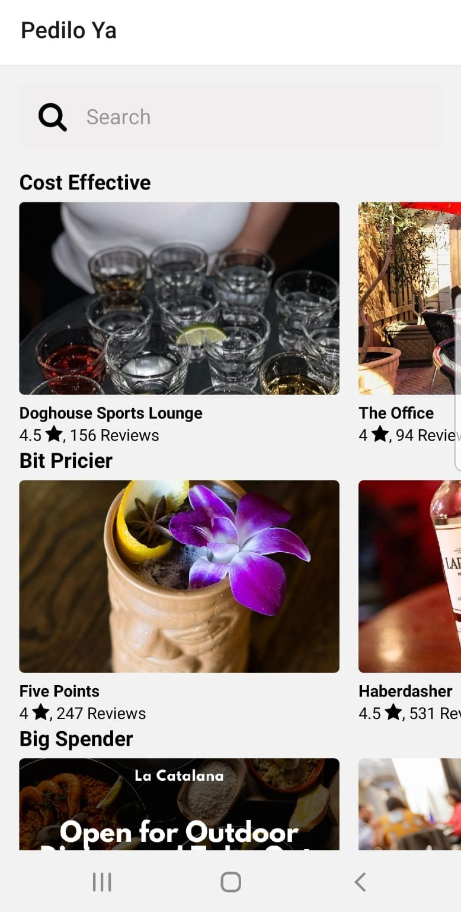

<h1>Hi there! I'm Lu</h1>
<h2>I'm a Full Stack developer with a strong orientation to Front-End. Currently training myself in Henry's intensive Bootcamp.</h2>
 
<h3>I am passionate about learning and I have found something I love doing because I never settled. Even though there's still much for me to learn in this huge sea of knowledge and new technologies, that drives me to keep me on my toes still learning and reinventing myself every step of the way.</h3>
 
MY STACK  
. Javascript 
. ReactJs 
. Redux 
. PostgreSQL 
. Sequelize 
. NodeJs 
. Express 
. HTML5 
. CSS3 
. SCRUM methodologies 
. Bootstrap 
. Git | Github 
 
I've worked as an administrative assistant for five years, that's why I'm exceptionally <strong>well-organized</strong>, <strong>problem-solving</strong>, able to effectively <strong>multi-task</strong>, <strong>prioritize</strong> and <strong>take initiative</strong>.
 
I'd like to be part of a team where I can keep growing, learning, and developing in this beautiful career I chose.
 
 
Contact me!
Tell me about your proposal to:  lucilamfortunato@gmail.com or through LinkedIn direct message. 
 
 
<h3>Projects</h3> 

<h4>Food App</h4>
 

Development of a Mobile App using <strong>React Native</strong>
and <strong>Expo Cli</strong> for the Front-End. The SPA consumes data from <strong>YELP API</strong>
Some features of the project: 
· Searches with default search · Show Restaurants · Show Restaurant Details. <a href="https://github.com/lmfortunato/foodMobileApp">Link to project</a>

 
 

<h4>Countries App</h4>
 

Development of a SPA (Single Page Application) using <strong>React</strong>
and <strong>Redux</strong> for the Front-End. The SPA consumes data from an
API ("Rest Countries") and stores it in a database, created with
<strong>PostgreSQL</strong> and <strong>Sequelize</strong>, through a BackEnd developed in
<strong>NodeJS</strong> with <strong>Express</strong>.
Some features of the project: 
· Searches · Creation of activities · Sorting · Filters. <a href="https://github.com/lmfortunato/PI-Countries">Link to project</a>

 
 
<h4>Kekukis E-Commerce</h4>
 

A dynamic web that consists of an e-commerce simulation developed with vanilla <strong>javascript</strong>, HTML5, and CSS3. Using Sass as a CSS processor, <strong>JQuery</strong>, and bootstrap as a library.
Some features of the project:
Filters by categories, add to cart, save information in <strong>Local Storage</strong>. <a href="https://github.com/lmfortunato/Kekukis_Ecommerce">Link to project</a>

 
 
<h4>LA Cirugía Plástica Estética y Reparadora</h4>
 

Responsive static web developed with <strong>HTML5</strong> and <strong>CSS3</strong>. Using <strong>Sass</strong> as a CSS processor and <strong>Bootstrap</strong> as a library. <a href="https://github.com/lmfortunato/LA_CirugiaPlastica">Link to project</a>

